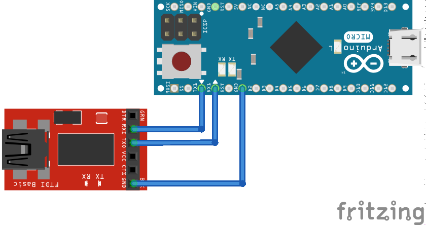
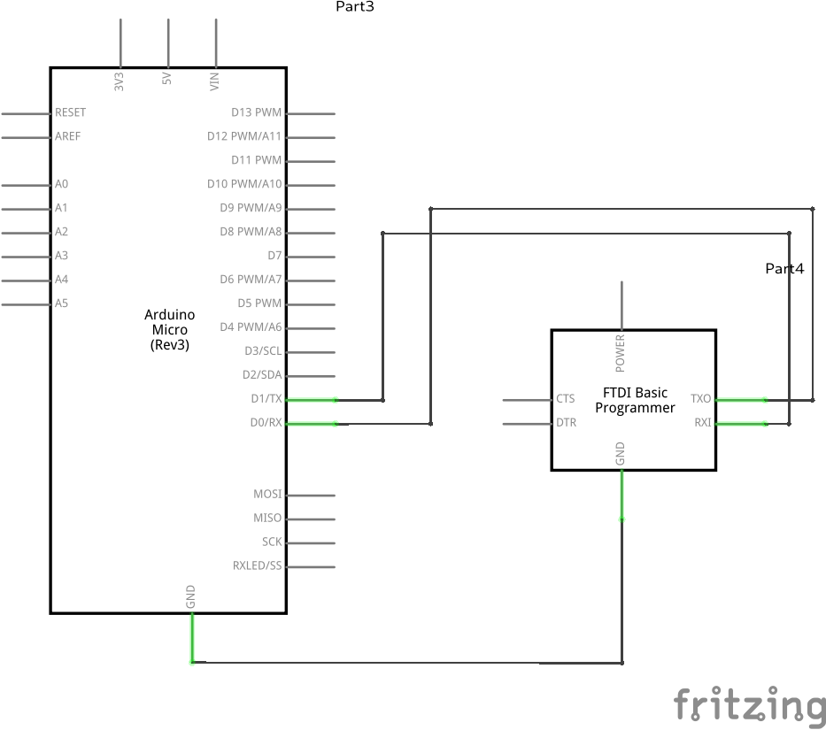
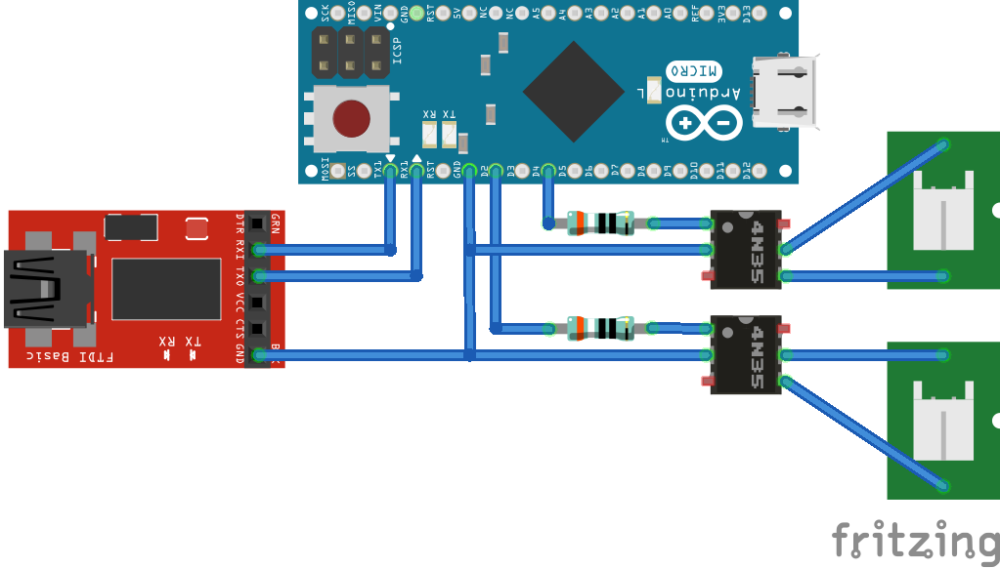
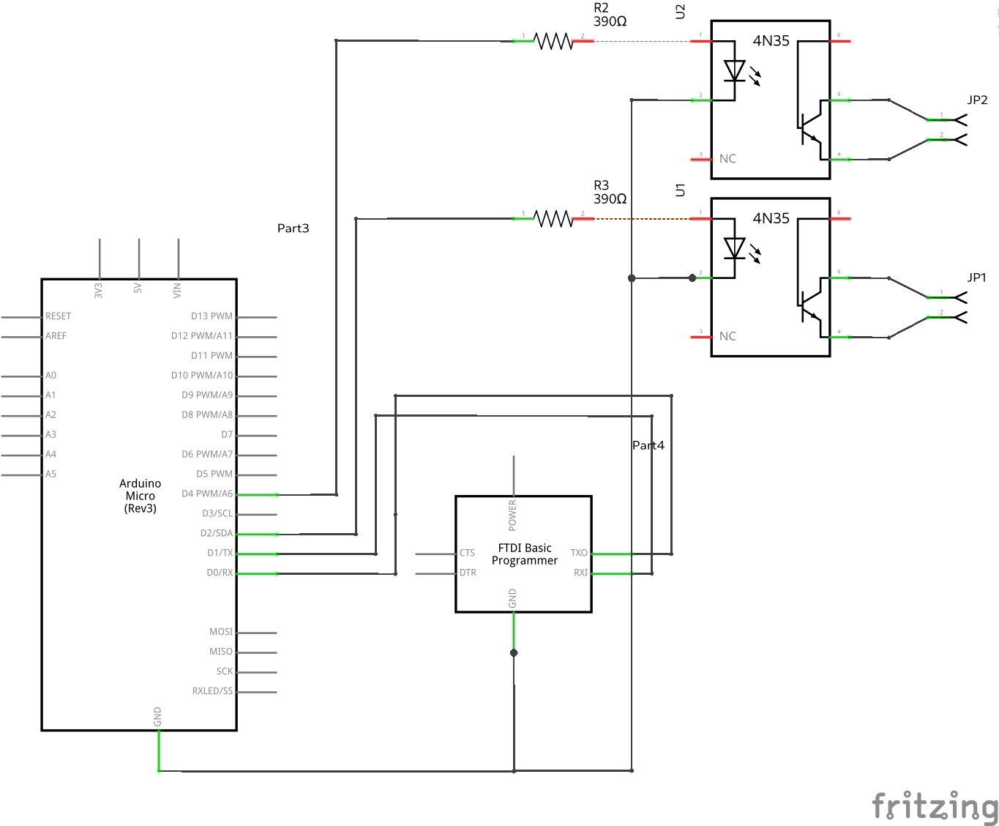
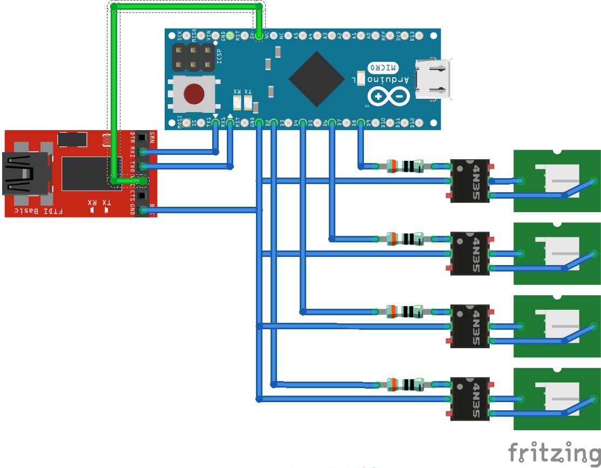
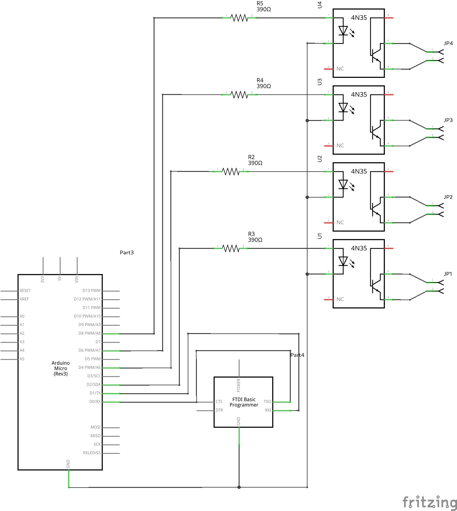
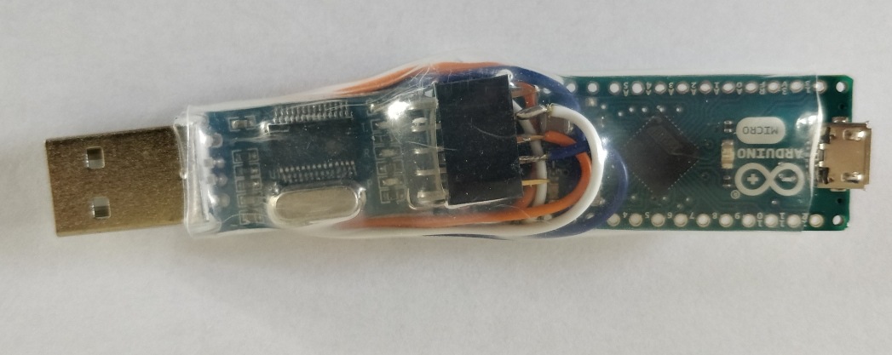
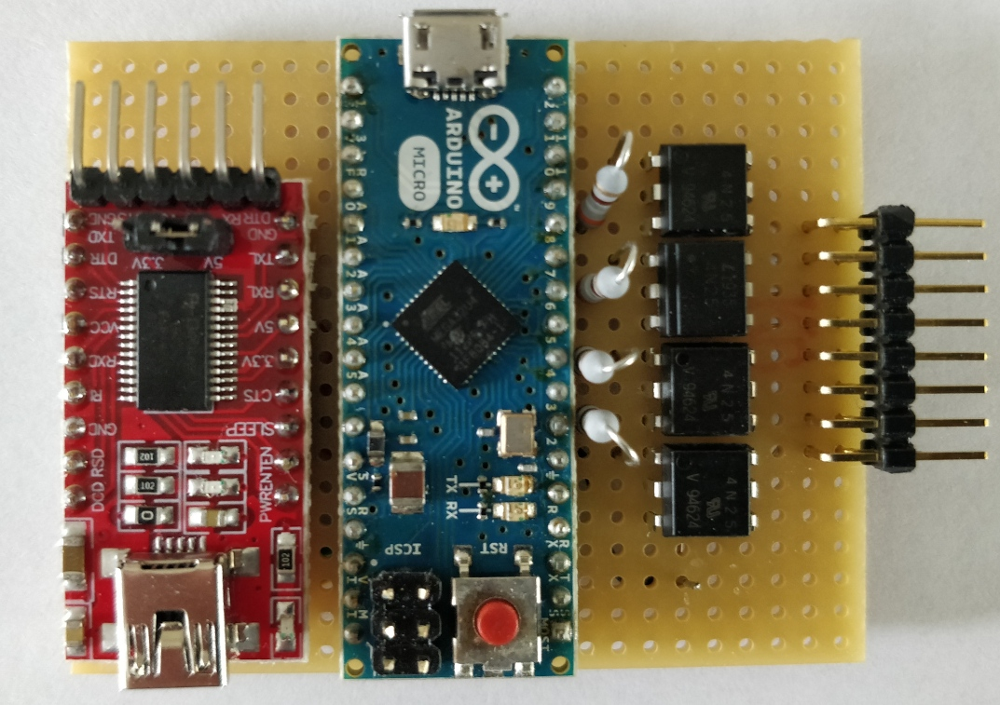
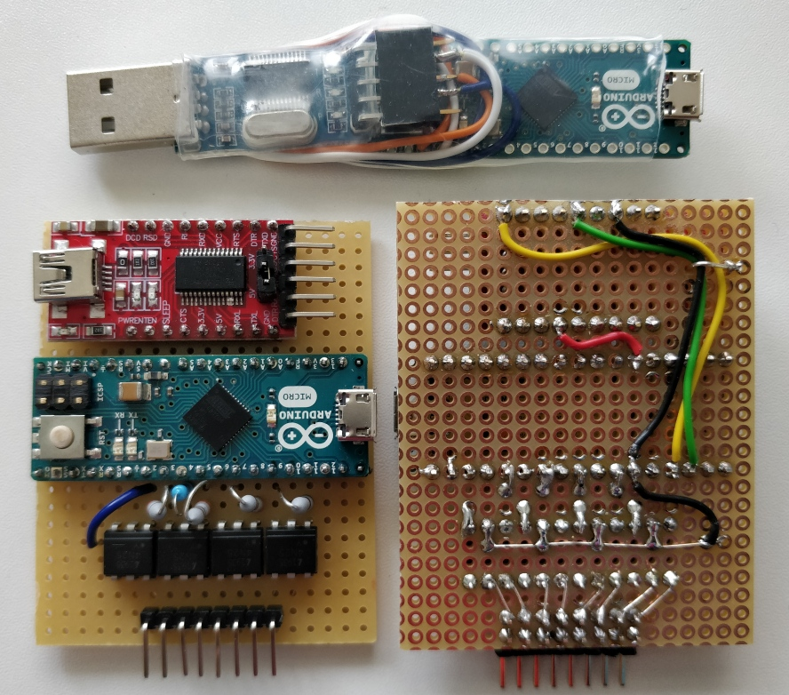

# 	RubberJogi

## What is the idea / the usecase ?

* You want to control a PC from another PC, making keystrokes, eventually mouse-moves.
* Even when starting up and e.g. entering the BIOS 
* => ssh etc not an option
* you need to be independant from any "client" on the controlled machine
* only solution which comes to mind is : USB HID
* Therefore you connect from PC I somehow to PC II, on PC II as USB-Keyboard


## Solution : RubberJogi


    +----------------+                                  +----------------+
    |                |                                  |                |
    |    PC I        |                                  |    PC II       |
    |                |          +-------------+         |                |
    |  (Controller)  | USB      |             |  USB    |  (Worker)      |
    |                +--------->+ RubberJogi  +-------->+                |
    |                | serial   |             |  HID    |                |
    |                |          +-------------+         |                |
    |                |                                  |                |
    +----------------+                                  +----------------+

* PC I connects to RubberJogi via USB-Serial
* RubberJogi injects Keystrokes etc via USB HID to PC II 


## Ingredients Hardware


* Arduino ( with USB-Keyboard capability), e.g. Leonardo, Micro, etc

* USB-TTL UART Converter , FTDI Serial

* some cables

  

  

## Ingredients Software 

* As it is not possible to send CMD-Keys like ALT, CTRL via serial line, a language has to be used.
* Avoid to reinvent the wheel ==> Compatible to the famous [**RubberDucky**-Script-Language](https://github.com/hak5darren/USB-Rubber-Ducky/wiki/Duckyscript)
* ==> Based on arducky by Baptiste MOINE (Creased), THANKS!
* Parser is based on https://github.com/Creased/arducky/blob/master/arducky.ino
* is partially extended for also sending MOUSE-Movements
* is already extended to control four additional GPIO-Switches 
* Accepted Commands :
    * All RubberDucky-Commands (not really all...)
    * ```backspace```
    * ```switch1_on``` / ```switch1_off```  => switching Optocoupler at Pin2 
    * ```switch2_on``` / ```switch2_off```  => switching Optocoupler at Pin4 
    * ```switch3_on``` / ```switch3_off```  => switching Optocoupler at Pin6 
    * ```switch4_on``` / ```switch4_off```  => switching Optocoupler at Pin8
    * ```boot``` => switching Optocoupler at Pin2 for 1.5 sec high, then low
    * ```reboot``` => switching Optocoupler at Pin2 for 10sec high, then low, after a delay of 2 secs then once more for 1.5 sec high, then low
    * ```aten``` => switching Optocoupler at Pin4 for 1.5 sec high, then low
 

### Controlling 

For "talking" to the RubberJogi from PC1 you need to configure your serial port to

* 9600 Baud
* 8 Bit, 1 Stop-Bit, No parity


If you are using a linux-box you could use the follwing command to achieve this:   

```stty -F /dev/ttyUSB0 cs8 9600 ignbrk -brkint -icrnl -imaxbel -opost -onlcr -isig -icanon -iexten -echo -echoe -echok -echoctl -echoke noflsh -ixon -crtscts```


## Special Hardware with 2 switches

* In our/my usecase we also need to control two switches

* one of these is connected to the reset-button of the PC

* the other one is connected to the switch of a USB-sharing station, so we can switch a USB-stick between PC1 and PC2 ...

* more explanations will follow, the code is already able to make use of these 

* here at least are the schematics

* In case you want (like we do) to switch on PC2 with a command from PC1 you need to connect Vcc between FTDI and Arduino, otherwise the Arduino will not have power when he is connected to a switched of PC ... ( see the green cable below)
* Unfortunately, it looks like this is backfeeding 5V even to the 2nd PC via USB. This is not a problem if the PC is switched on. __BUT__ : If you have the PC switched off and want to switch it on, then - depending on the PC - it might make some trouble for the PC, as it is never __really__ switching completely off. I need to try this remedy : https://forum.arduino.cc/t/powering-the-arduino-with-a-5v-power-supply/261902/12
 


  


  


## Extended Special Hardware with 4 switches

  - in the meantime we even have use-cases where we need to control up to 4 switches

  - as before one of these is connected to the reset-button of the PC (in our case)

  - as before one is connected to the switch of a USB-sharing station, so we can switch a USB-stick between PC1 and PC2 ... (in our case)

  - the other 2 switches are needed to control boot-sel switches of embedded ARM systems  

  - here are the additional schematics

  - In case you want (like we do) to switch on PC2 with a command from PC1 you need to connect Vcc between FTDI and Arduino, otherwise the Arduino will not have power when he is connected to a switched of PC ... ( see the green cable below)

    

    

## Reality

This is one sample-prototype without any switches, just the "plain" RubberJogi. This was soldered "flying" and is only stabilized with heat shrink tube.




This is one sample-prototype, with 4 switches, soldered on a veroboard/breadboard





These are all 3 prototypes I have built, together on one picture. 

* 2 times extended RubberJogis with 4 switches
* 1 as a pure RubberJogi, no switches.



## Parts-List

What do you need to build a RubberJogi?


| Part                                                  | Rubber<br> Jogi<br> Standard | Rubber <br> Jogi<br>Two Switch | Rubber <br> Jogi<br>Four Switch |
| ----------------------------------------------------- | ---------------------------- | ------------------------------ | ------------------------------- |
| Arduino Micro                                         | 1                            | 1                              | 1                               |
| FTDI USB / Serial Converter 5V capable                | 1                            | 1                              | 1                               |
| Cables between Arduino/FTDI<br>(Vcc, GND, RxD, TxD)   | 4                            | 4                              | 4                               |
| USB-Cable to Arduino <br />(USB-A to Micro-USB)       | 1                            | 1                              | 1                               |
| USB-Cable to FTDI<br>(USB-A to Mini-USB)              | 1                            | 1                              | 1                               |
| Veroboard                                             | ?                            | ca 60x50 mm                    | ca 60x50mm                      |
| Header Arduino<br>(when not using already w/ headers) | ?                            | 34                             | 34                              |
| Header FTDI                                           | ?                            | 18                             | 18                              |
| Optocoupler 4N25 DIL                                  | 0                            | 2                              | 4                               |
| Resistor 390 Ohm                                      | 0                            | 2                              | 4                               |
| Connectors, depends on your needs, e.g                | 0                            | 2                              | 4                               |
| **Example**: Headers for switches                     | 0                            | 4                              | 8                               |


